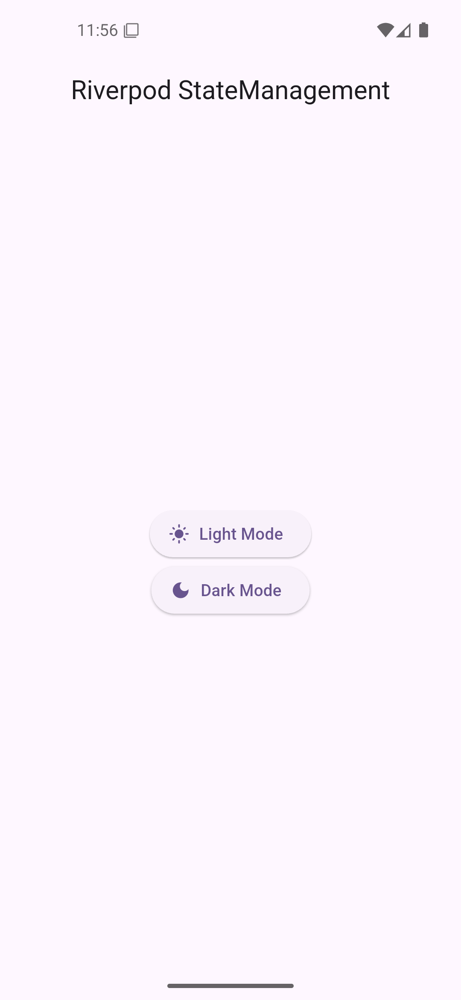
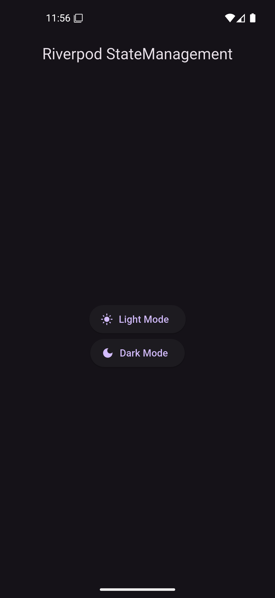

# ⚙️ Riverpod Easy Level App  

A simple **Flutter state management guide using Riverpod**. This app demonstrates the basics of Riverpod, including **StateProvider**, **watch vs read**, and **StateNotifierProvider** for better state management.


## ✨ Features  

- **StateProvider Usage** – Demonstrates how to use StateProvider for simple state management.  
- **ConsumerWidget Implementation** – Uses ConsumerWidget to listen to providers.  
- **watch vs read** – Explains how to use `ref.watch()` for UI updates and `ref.read()` for state modifications.  
- **StateNotifierProvider for Advanced State Management** – Uses StateNotifier for managing complex state logic.  
- **Scoped State Management** – Organizes state providers for better scalability.  


## 📸 Screenshots  
<p align="center">
    
    


## 📦 Dependencies  

| Package                 | Purpose                                      |  
|-------------------------|----------------------------------------------|  
| `flutter_riverpod`      | Provides state management using Riverpod.   |  


### Install dependencies using:  
```sh
flutter pub get
```

## Installation  

1️. Clone the repository:  
```bash
git clone https://github.com/your-username/riverpod-easy-app.git  # Replace with your actual repository URL
```

2️. Navigate to the project directory:  
```bash
cd riverpod-easy-app
```

3️. Install dependencies:  
```bash
flutter pub get
```

4️. Run the app:  
```bash
flutter run
```


## 💡 Usage Guide  

1. **Basic State Management with StateProvider**  
    ```dart
    final counterProvider = StateProvider<int>((ref) => 0);
    ```  
2. **Access Provider in a Widget**  
    ```dart
    class MyWidget extends ConsumerWidget {
      @override
      Widget build(BuildContext context, WidgetRef ref) {
        final count = ref.watch(counterProvider);
        return Text('Count: $count');
      }
    }
    ```  
3. **Modify State**  
    ```dart
    ElevatedButton(
      onPressed: () => ref.read(counterProvider.notifier).state++,
      child: Text('Increment'),
    );
    ```  


## 🔹 Advanced State Management (StateNotifier)  

1. **Define a Notifier for Managing State**  
    ```dart
    class CounterNotifier extends StateNotifier<int> {
      CounterNotifier() : super(0);
      void increment() => state++;
    }
    ```  
2. **Create a StateNotifierProvider**  
    ```dart
    final counterNotifierProvider = StateNotifierProvider<CounterNotifier, int>(
      (ref) => CounterNotifier(),
    );
    ```  
3. **Use the Notifier in a Widget**  
    ```dart
    class CounterScreen extends ConsumerWidget {
      @override
      Widget build(BuildContext context, WidgetRef ref) {
        final count = ref.watch(counterNotifierProvider);
        return Column(
          children: [
            Text('Count: $count'),
            ElevatedButton(
              onPressed: () => ref.read(counterNotifierProvider.notifier).increment(),
              child: Text('Increment'),
            ),
          ],
        );
      }
    }
    ```  


## 🎯 Key Riverpod Concepts  

| Concept          | Description  |  
|-----------------|--------------|  
| `ref.watch()`   | Listens to provider changes and rebuilds the widget.  |  
| `ref.read()`    | Reads provider data once without listening for updates.  |  
| `StateProvider` | Manages simple state changes.  |  
| `StateNotifierProvider` | Manages complex state logic and updates.  |  

